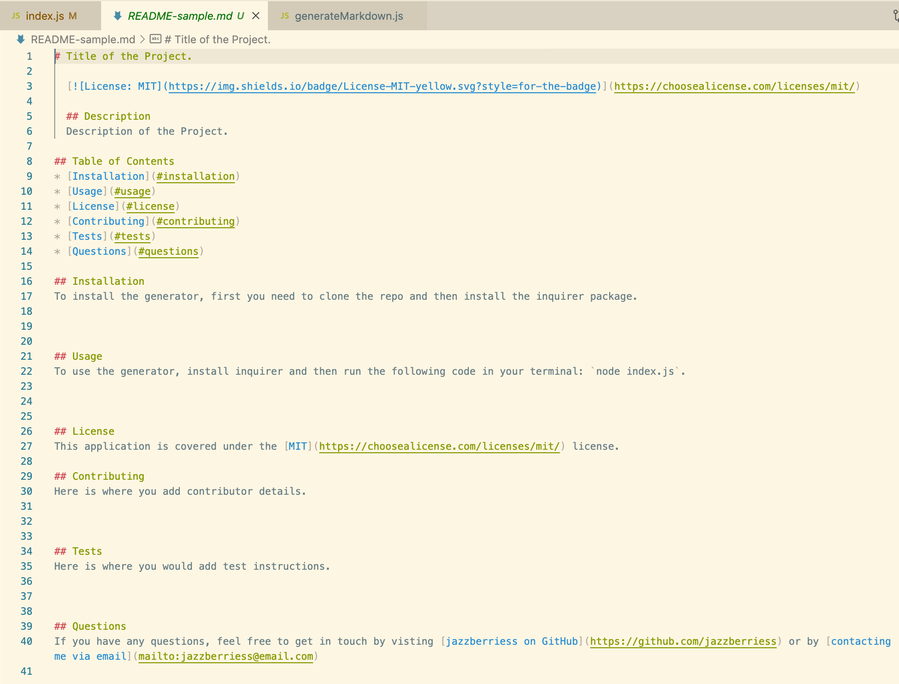
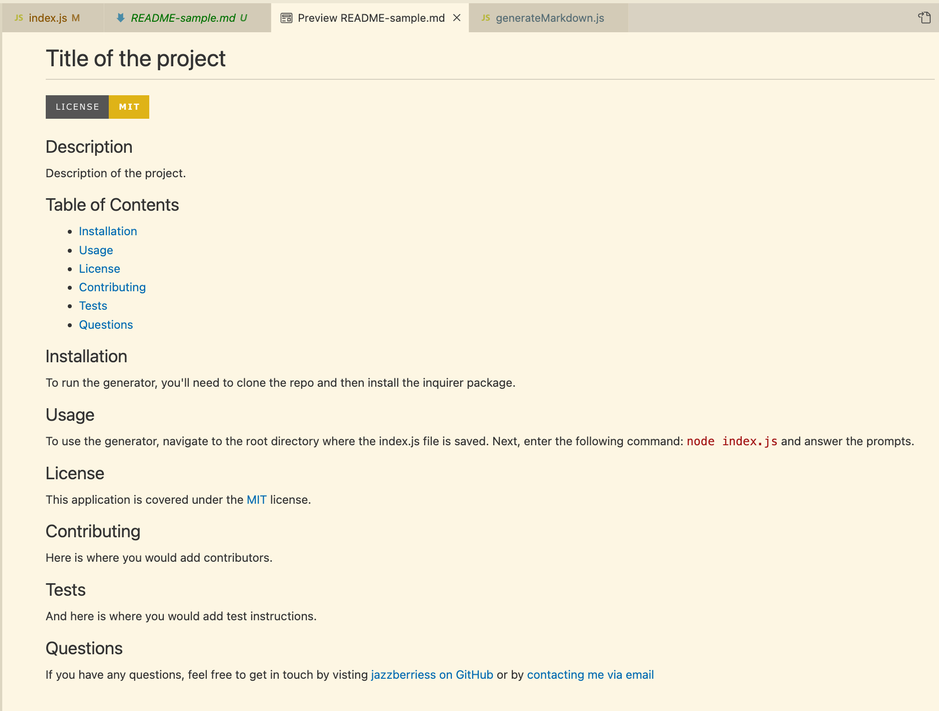

# Professional README Generator

## Description
A generator that uses node.js and the inquirer.js package to create a professional readme file based on information that a user inputs when prompted from the command line

## Table of Contents

* [Installation](#installation)
* [Usage](#usage)
* [Live Demo](#live-demo)
* [Technologies Used](#technologies-used)
* [Resources](#resources)
* [License](#license)
* [Contact](#contact)

## Installation
To run the README Generator, you'll first need to clone the [prof-readme-generator repo on GitHub](https://github.com/jazzberriess/prof-readme-generator) or download the zipfile, then [install the inquirer package](https://www.npmjs.com/package/inquirer).

To install inquirer.js, navigate to the root directory of the cloned or downloaded repo. In either your terminal, command line or using the integrated terminal in your code editor of choice, enter the following command:

`npm i inquirer`

OR

`npm install inquirer`

## Usage
To use the README generator, clone or download the repo and install inquirer.js as instructed above.

Next, enter the following command in either your terminal, command line or using the integrated terminal in your code editor of choice:

`node index.js`

Then, answer the prompts.

Once the prompts have been filled, a `README.md` file will be generated in the root folder of the directory for you to then copy or move to whichever project it is for.

## Live Demo

### [Video demonstration of the application being used](https://drive.google.com/file/d/1nLnyomLEZivFcPf3FH_YvPjfqCKxlzcV/view) in the integrated terminal in VS Code.

The sample readme file that was generated during this video can be found by viewing the [README-sample.md file](https://github.com/jazzberriess/prof-readme-generator/blob/main/README-sample.md).

### Demonstration of the application using the terminal on Mac OS to answer the prompts:

### Screenshot of the generated readme file in Visual Studio Code:

### Screenshot of the generated readme file preview in Visual Studio Code:

## Technologies Used
This application was built using:
* JavaScript
* Inquier.js

## Resources

* [Inquirer.js package](https://www.npmjs.com/package/inquirer)
* [Choose A License](https://choosealicense.com/licenses/)
* [Shields badges](https://shields.io/category/license)
* [Markdown License Badges](https://gist.github.com/lukas-h/2a5d00690736b4c3a7ba)
* [Professional README guide](https://coding-boot-camp.github.io/full-stack/github/professional-readme-guide)
* [Markdown Guide](https://www.markdownguide.org/)
* [Inquirer validation](https://stackoverflow.com/questions/57321266/how-to-test-inquirer-validation)
* [How to change node.js's console log font color](https://stackoverflow.com/questions/9781218/how-to-change-node-jss-console-font-color)
* [Console colors](https://gist.github.com/abritinthebay/d80eb99b2726c83feb0d97eab95206c4)
* [MDN Docs - Template Literals](https://developer.mozilla.org/en-US/docs/Web/JavaScript/Reference/Template_literals)
* [MDN Docs - Switch Statements](https://developer.mozilla.org/en-US/docs/Web/JavaScript/Reference/Statements/switch)

## License
This project is covered under the [MIT license](https://github.com/jazzberriess/prof-readme-generator/blob/main/LICENSE).

&copy; 2022 Christi Scappatura

## Contact
Contact me at [jazzberriess on GitHub](https://github.com/jazzberriess).